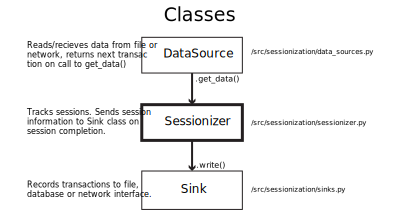

# Sessionization Insight Challenge

This program tracks user sessions from EDGAR logs. Currently, it provides facilities for reading data published as CSV 
files, but it is designed to extend easily to other data sources (i.e. network streaming).

## Installation and dependancies

This should not require installation, but the following dependancies should be met: 

* Python >= 3.5

 Tested on Python 3.6.
 


# Sessionizer algorithm and data structure
The core algorithm is stored in [src/edgar_sessionizer/sessionization.py](./src/edgar_sessionizer/sessionization.py)

This algorithm works with average computational complexity of *O(nm)*, where _n_ is the number of unique sessions, and 
_m_ is the number of transactions per session. Worst case computational complexity is _O(n^m)_, if the data is 
adversarial to the Python hashing function.

### Requirements:
* We need a way to quickly keep track of which sessions expire in a given second without looping through all open sessions.
* We need a way to quickly access arbitrary sessions when they expire.

### Data structure:
To do this, I’ve chosen to use a double hash map strategy using Python dictionaries:

1. The first *expiration time* dict stores the client IP addresses of open sessions mapped to the times at which they *might* 
expire and should be serviced. Client's IP addresses are stored in a FIFO queue.

2. The second *session* dict stores data structures representing information about the session keyed by IP address. The 
data structure contains information about the session start time, the latest transaction time, and the IP address of the
client.


### Algorithm
Once parsed, a transaction record is processed in the following flow:
1. If the session's client identifier (IP) is in the hash table, a transaction is added
with the timestamp of the transaction to that session tracker. If the client IP is not in the hash table,
it is added, and a new session tracking object is created to track the session. **This session tracker 
maintains a record of the session start time, the IP, and the timestamp of the latest request**
2. The expiration time for the session is calculated based on the time of the transaction. If the expiration time 
exists in the expiration hash table, the client IP is added to it's queue. If the expiration time is not in the table, 
it is added and a new FIFO queue is mapped to the time.

If time has iterated, the program must check to see if any sessions have expired. This is made efficient using the
expiration hash table:

1. If the transaction is at a timestamp that is greater than previous transactions, time has iterated. All
expiration times in the expiration hash table that are less than the current time should be processed in order.
2. The queue corresponding to each expiration time is iterated through, yielding IP addresses. *It is possible that 
subsequent transactions have occurred for the session, so we must verify that the session has actually expired at this 
timepoint.*
3. Each yielded IP address is used in to look up the session information in the _session_ hash table. The expiration is
verified based on the latest transaction time recorded in the structure. If the session has not expired, do nothing and
move on to the next IP.
4. If a session has expired, send the session information to the Sink object, and delete the session from the hash table.


# Program design


This program is designed to be modular, with DataSources receiving and parsing data, the Sessionizer class preforming 
the processing, and Sink classes handling the saving or forwarding of Sessionizer output.

## DataSource API
DataSource subclasses can be easily made to handle different datatypes such as HTTP POST events. DataSource classes 
should adhere to the following API:

```python
from edgar_sessionizer.sources import DataSource, RequestRecord

class MyDataSource(DataSource):
    """Source for data for Sessionization from a network socket or a new filetype."""
    
    def __bool__(self):
        """ This should return True unless there is no more data available from this data source. Return false when the
        data source is exhausted (ie the network connection is lost or the end of a file is reached."""
        return True
    
    def get_next(self):
        # parse data and return as a RequestRecord.
        return RequestRecord(...)
```


### Streaming data sources
Streaming data would not arrive as a CSV, but rather as HTTP POSTs or the like. This was written with OOD, so handling 
this would be very easy using class polymorphism.

One must simply write an input class that handles network transactions (ie an interface with Falcon) that 
adheres to the same API principles as the CSV reader implemented [here](src/edgar_sessionizer/sources.py).


## Sink API
Sinks receive information about sessions parsed by the Sessionizer. They then save the session data to disk or can pass
the data to another process as required (ie SQL database, network socket, etc.). They should adhere to the following API:

```python
from edgar_sessionizer.sinks import Sink

class MySink(Sink):
    def write(self, session):
        # save, transmit, etc...
        return
```

An example Sink class that writes to a CSV can be found [here](./src/edgar_sessionizer/sinks.py).


# Scaling
In the actual implementation specified, the data source would look more like a stream of JSON inputs from HTTP posts or something similar. Scaling would mean being able to handle more transactions per second and more simultaneously open sessions. Transactions per second are limited by computational speed and complexity of our algorithm, while the limit on simultaneous sessions is dictated by the RAM available to our program.

**One strategy that would alleviate both space and time limitations would be to map different sessions to a cluster of machines.** This could be done relatively easily by having a master input server which would quickly quickly distribute incoming data to different processing servers. Session information from the processing servers would be forwarded to a logging server that would write the data to disk.

Input server(s)  -> Processing cluster -> Database server or log writer.

### Mapping to multiple processes
**Each transaction would be forwarded to a specific processing server based on the transaction’s IP address.** 
Transactions from the same client IP are part of the same session and must should be processed together. To distribute 
the data, the master server might quickly decode the client IP, and apply a hash function to it. The resulting hash 
would define which processing server the transaction would be forwarded to. _Hash functions are deterministic, so 
transactions from the same client IP would all be sent to the same processing server._

Data could be passed to local or remote processes using TCP socket wrappers such as ZMQ. This forwarding could be 
also be implemented using AWS lambda functions instead of on a server (scalable and serverless).

### Processing
Processing would be mostly conserved from this package, but the input class would handle transactions forwarded from the
input server that distributes tasks.

### Reducing to a log file or database.
Once a processing server determines that a session has expired, it can send a message containing the loggable information 
to a separate process. Again this can occur via a network socket protocol. The logging server would simply keep a receive 
incoming transactions and would write them to an open file.

Robust implementations that are much better than this are available off the shelf using a SQL/NoSQL database servers.

## Exception handling
Losing a transaction is really not the end of the world.
* If we lose a lines that are for open sessions, the some of the sessions might expire sooner than they should.
* If we lose lines that open sessions, we will either 1) lose sessions entirely, or 2) underestimate the session length because we will open the session in the next transaction.

